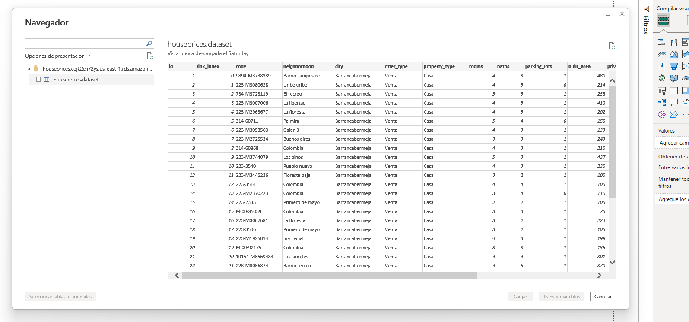

# Project Description

The project is structured as follows:


## Explaining step by step what the project do

*the project is not runnable, it's only for auto-educational purposes, many of the data are fixed and depend on my local machine*

Basically these files scrap three of the most  popular site to buy houses, apartments or occupy an office.
Performs a 'robot' task on each webpage that provide the facility offer information and then with the aid of pandas
process, clean and load the data into a csv file that will be loaded into a AWS RDS database.  

The time spent to obtain the data from de bot script `collect.py`, it's approximatelly as minimum 2 hours upto 4 depending of your setup
however, I got the dataa for your I really don't recommend reproduce the project since the entire performing of this took about 2 days.  

Futhermore the run of the project, I have obtained the result of this, so you can check what is the final result of the `.csv` file at the `./data` directory.  

### `./data` Directory.

- `.dat` files are the information scraped from all the websites.  
`mecu.py` -> `mecu.dat` (metrocuadrado.com)  
`finra.py` ->  `finra.dat` (fincaraíz.com)  
`punpro.py` ->  `punpro.dat` (puntopropiedad.com)  

- `.csv` file is the merge of all the `.dat` files
- And `sample` directory it's a backup to have a security backup, since the `datamerge.csv` might be rewrited during the project testing.


### Sequence of the project.

(optionally)  
Before you may run any script, it's neccessary that you fill some forms.
```
db_instance_cli_input.json
vpc_egress_auth.json
vpc_ingress_auth.json
```
The project assume it's only for educational purposes, so the username and passwords are too generics.  
In real cases or production step, it's mandatory fill the `.json` config creation files with your own data depending on your purposes and specs.  

> For instance `db_instance_cli_input`, define your own username or passwords:
```
{
    "DBName": "houseprices",
    "DBInstanceIdentifier": "houseprices",  <--- Alterable
    "AllocatedStorage": 20,
    "DBInstanceClass": "db.t3.micro",
    "Engine": "mysql",
    "MasterUsername": "houseprices",    <--- Alterable
    "MasterUserPassword": "houseprices",    <--- Alterable
    "Port": 3306,
    "EngineVersion": "8.0.28",
    "StorageType": "gp2"
}
```

> Also you can add whatever amount of IP for access remotely the database.
```
{
    "GroupId": "sg-05f6fbf2b522e7ae9",
    "IpPermissions": [
        {
            "FromPort": 3306,
            "IpProtocol": "tcp",
            "IpRanges": [
                {
                    "CidrIp": "xxx.xx.xx.xxx/32",   <--- set your own IP range.
                    "Description": ""
                }
            ],
            "Ipv6Ranges": [],
            "PrefixListIds": [],
            "ToPort": 3306,
            "UserIdGroupPairs": []
        }
    ]
}
```

> So having said all about `.json` files, te project can be executed.


1. The first task the shall be executed is invoke the bash script `collect.py` located at root `./` directory. It gets all the links to scrap.
2. Now having collected all the links to access and get, we invoke the `scrap.sh` shell script at `./deploy` directory. It run all the `.py` file to scrap every webpage,
and then save all the found information into the `.dat` files.
3. At this point we have saved the data into `.dat` files, we invoke the `merge.sh` shell script to 'paste' them.
4. Pasted all the `.dat` file now it's time to deploy our database in AWS RDS. The `deploy.sh` make the entire job.

  
  
After all these steps, I should have an functional cloud-based database for access wherever there's a laptop and internet connection. 
  
The following images show how to access to a remote RDS database on cloud.
---
  
1. go to the data GUI interface.
  

  
2. Provide both the `endpoint` and `database name` of the remote instance of the database.
  

  
3. Perform any required transform task on Powerquery.

  
4. Data Ready to make insights.
  


